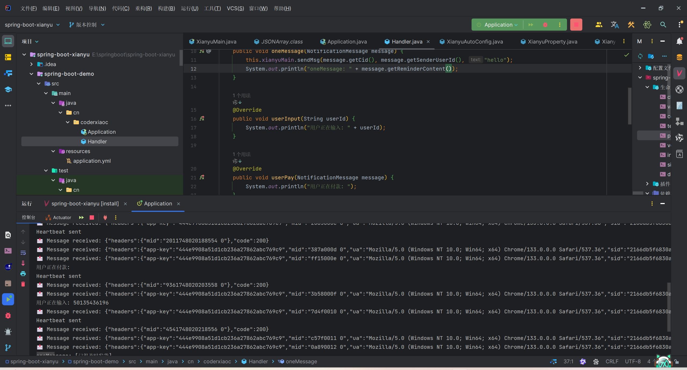
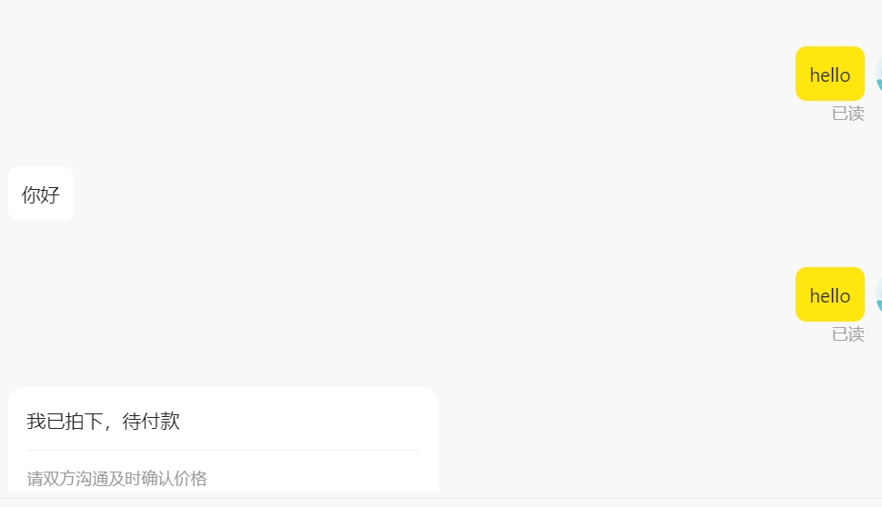
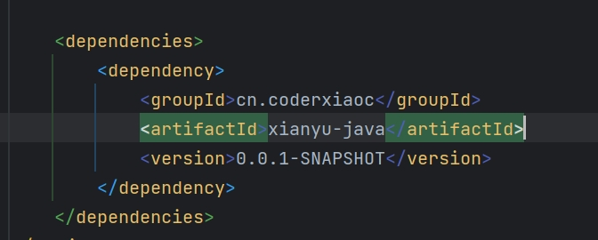
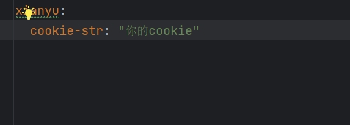
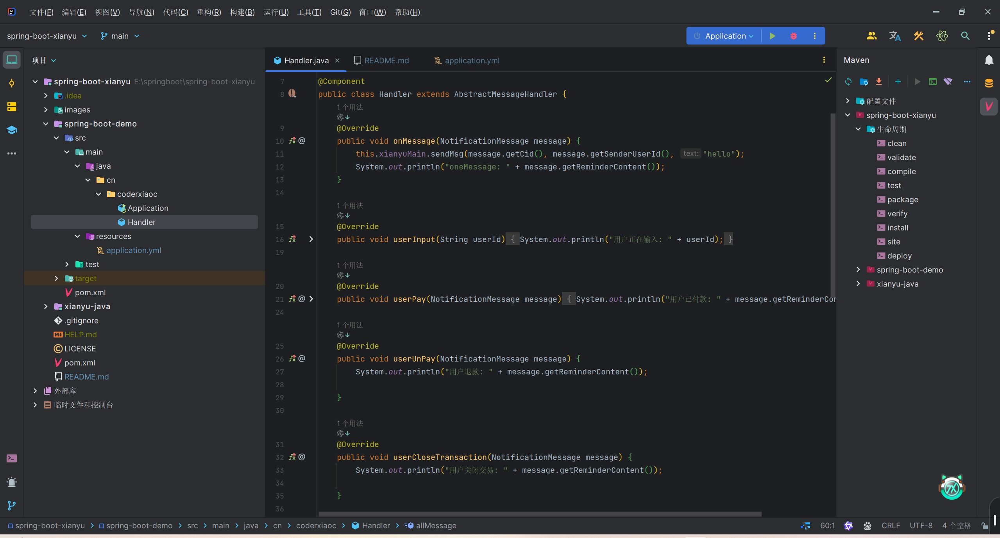

# 🚀 xinayu-java - 一个监听咸鱼的聊天框架

  

为springboot项目提供对咸鱼平台消息监听，可以再此基础上继承springai实现智能客服，由于是第一次开发比较仓促后面后面又时间会优化和改进代，请各位大佬莫要笑话在下。

## 🌟 核心特性

### 智能对话引擎
| 功能模块     | 功能简述                               |
| ------------ | -------------------------------------- |
| 监听用户聊天 | 可以监听用户发送的消息以及各种下单操作 |
| 回复用户聊天 | 可以回复用户消息                       |

## 🎨效果图

  
   

  
   

## 🚴 快速开始

### 环境要求
- Java 8+

  

### 安装步骤

1. 由于没有上传到maven需要到本仓库自行拉取

    git clone https://github.com/codermyxiaoc/xianyu-java.git

2. 在springboot项目使用
    pom文件导入对应依赖xianyu-java

  
   

3. 配置咸鱼cookie
    在aplication.yml配置xianyu.cookie-str
    cookie在闲鱼网页端获取cookies(网页端F12打开控制台，选择Network，点击Fetch/XHR,点击一个请求，请求头查看cookies)

  
   

4. 实现AbstractMessageHandler类对各种消息监听

  
   

## 🤝 参与贡献

欢迎通过 Issue 提交建议或 PR 贡献代码，请遵循 [贡献指南](https://contributing.md/)

## 🛡 注意事项

⚠️ 注意：**本项目仅供学习与交流，如有侵权联系作者删除。**

鉴于项目的特殊性，开发团队可能在任何时间**停止更新**或**删除项目**。

如需学习交流，请联系：codexiaoc@163.com

## 🧸特别鸣谢
本项目参考了以下开源项目：
https://github.com/cv-cat/XianYuApis

